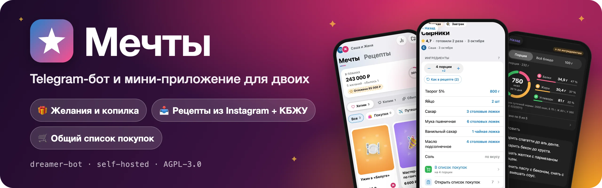

# dreamer-bot

<p align="center"></p>

**Личный Telegram-бот и мини-приложение для двоих:** общий список желаний с копилкой, рецепты с импортом из Instagram и подсчётом КБЖУ, общий список покупок. Пользоваться могут только те, кого вы впишете — остальным бот просто не отвечает.

[](https://github.com/Mikkkin/dreamer-bot/actions/workflows/ci.yml)
[](LICENSE)

🇬🇧 [English version](README.en.md)

<p align="center">
  
  
  
</p>

## Что умеет

- 🎁 **Желания** — «Хотим → Копим → Сбылось», фото и ссылки, копилка с процентом накопленного.
- 📥 **Рецепт из Instagram одной ссылкой** — пришлите боту рилс: название, ингредиенты, шаги и фото заполнятся сами. С ключом Gemini — даже если рецепт только в видео.
- 🍽 **Порции и КБЖУ** — «− 4 порции +» пересчитывает весь рецепт, КБЖУ считается по ингредиентам и показано графиком.
- 🥄 **Нормальные единицы** — «½ чайной ложки», «2 столовые ложки»; вводить можно `1/2`, `1 1/2`, `0,5`, «полторы».
- 🛒 **Общий список покупок** — ингредиенты рецепта одним нажатием, одинаковое складывается: 200 мл + 0,5 л = 700 мл.
- ⭐ **История готовки** — «Приготовили», оценки обоих, «Что приготовить?» наугад.
- 🔔 **Уведомления партнёру** о новых желаниях, рецептах, накоплениях и сбывшихся мечтах.

## Установка за 3 команды

**Понадобится**
- чистый сервер с Ubuntu или Debian (amd64 или arm64, от 1 ГБ RAM — на маленьких скрипт сам добавит swap) и вход на него под root;
- на своём компьютере — `git` и `ssh` (в macOS и Linux уже есть, в Windows — Git Bash или WSL);
- токен бота: [@BotFather](https://t.me/BotFather) → `/newbot`;
- домен для мини-приложения — подойдёт бесплатный: поддомен на [FreeDNS](https://freedns.afraid.org) или [DuckDNS](https://www.duckdns.org). **A-запись на IP сервера создайте заранее** — скрипт проверит DNS и подождёт, пока она заработает. Без домена работает только чат-бот.

**0. Если на сервер входите по паролю**, сначала положите туда свой SSH-ключ — после установки вход по паролю закроется:

```bash
ls ~/.ssh/id_ed25519.pub || ssh-keygen -t ed25519   # создать ключ, если его ещё нет
ssh-copy-id root@IP_СЕРВЕРА
```

**1–3. Установка** — на своём компьютере:

```bash
git clone https://github.com/Mikkkin/dreamer-bot.git && cd dreamer-bot
scp deploy/setup-vds.sh root@IP_СЕРВЕРА:
ssh -t root@IP_СЕРВЕРА 'bash setup-vds.sh'
```

Скрипт [`deploy/setup-vds.sh`](deploy/setup-vds.sh) задаст вопросы и сделает остальное сам: обновит систему, создаст вам пользователя, закроет вход по паролю и под root, включит firewall и fail2ban, поставит Docker, соберёт бота прямо на сервере, получит HTTPS-сертификат и запустит всё — обычно за несколько минут. Вопросы — по порядку:

| # | Спросит | Что ответить |
|:-:|---|---|
| 1 | Обновить пакеты системы? | Enter — да |
| 2 | Имя пользователя для SSH | Enter — `deploy`, или своё |
| 3 | Пароль для sudo | придумайте: он нужен для `sudo`, по SSH с ним не войти |
| 4 | Публичный ключ — *только если у root нет ключей* | `cat ~/.ssh/id_ed25519.pub` на своём компьютере |
| 5 | **Вход под deploy по ключу работает?** | ⚠️ Не закрывая окно, в **новом** терминале выполните `ssh deploy@IP_СЕРВЕРА`. Вошли — `y`. Enter (= нет) откатит настройки SSH и остановит скрипт |
| 6 | `BOT_TOKEN` | от @BotFather, ввод скрыт |
| 7 | `ALLOWED_USER_IDS` | Enter, если не знаете, — бот пришлёт ID сам |
| 8 | Как открывать Mini App: 1, 2 или 3 | `1` — свой домен или FreeDNS, `2` — DuckDNS (спросит поддомен и токен), `3` — без домена |
| 9 | E-mail для Let's Encrypt | любой ваш |
| 10 | Валюта и часовой пояс | Enter — `EUR` и `Europe/Amsterdam`, или например `RUB` и `Europe/Moscow` |
| 11 | Ключ Gemini — необязательно | [aistudio.google.com/apikey](https://aistudio.google.com/apikey), бесплатно; Enter — пропустить |

<sub>Поставить из своего приватного форка: `REPO_URL=https://github.com/вы/форк.git REPO_SSH=git@github.com:вы/форк.git REPO_SETTINGS_KEYS=https://github.com/вы/форк/settings/keys bash setup-vds.sh` — скрипт покажет deploy key для *Settings → Deploy keys* (без write access).</sub>

## После установки

Под root вход теперь закрыт — заходите под своим пользователем:

1. Напишите боту `/start` — он пришлёт ваш Telegram ID. Пусть партнёр сделает то же.
2. На сервере:
   ```bash
   ssh deploy@IP_СЕРВЕРА
   sudo dreamer-vds ids        # спросит пароль sudo, вставьте оба ID через запятую
   ```
3. Снова `/start` — кнопка **✨ Мечты** откроет приложение.

## Обновление

```bash
ssh deploy@IP_СЕРВЕРА
sudo dreamer-vds update
```

Скачает новую версию, соберёт её, пока работает старая, сохранит копию данных в `/var/backups/dreamer/` и перезапустит бота. Данные (база и фото) живут в Docker-томе: обновление их не удаляет, а копию снимает до первого запуска новой версии — она может обновить схему базы.

Другие команды: `sudo dreamer-vds status | ids | env | backup | restore`. `env` заново задаёт все вопросы о настройках; чтобы поменять одну строку, проще `nano /opt/dreamer-bot/.env`, затем `cd /opt/dreamer-bot && docker compose up -d`.

## Как пользоваться

Всё основное — в мини-приложении: кнопка **✨ Мечты** в чате с ботом. А ещё боту можно просто прислать:

- **ссылку на пост или рилс Instagram** — получится рецепт;
- **текст, ссылку или фото** — получится черновик желания или рецепта с кнопками.

| Команда | Что делает |
|---|---|
| `/list` | Желания по статусам |
| `/recipes` · `/cook` | Все рецепты · случайный на сегодня |
| `/shop` | Список покупок: отметить купленное |
| `/stats` | Итоги по категориям и валютам |
| `/start` · `/help` · `/cancel` | Кнопка приложения · справка · отменить ввод |

## Скриншоты

| | | |
|:---:|:---:|:---:|
|  |  |  |
| Рецепты по кухням и типам | Импорт из Instagram | Проверка после импорта |
|  |  |  |
| Список покупок | Копилка | Статистика |

## Подробности

<details>
<summary><b>Импорт рецептов и ключ Gemini</b></summary>

Импорт работает и без ключей. Сервер читает пост так же, как превью ссылки: подпись и обложку. Правила выделяют название, ингредиенты с количествами, шаги и порции — обычно за пару секунд.

Ключ модели нужен для двух случаев:
- **подпись без понятной структуры** (сплошной текст, другой язык) — её разберёт модель;
- **рецепт только в видео** (голосом или текстом на экране) — ролик посмотрит Gemini. Это до 90 секунд, видео потом удаляется из хранилища Google.

Ключ спрашивает скрипт установки. Добавить или сменить его позже: строка `LLM_API_KEY=…` в `/opt/dreamer-bot/.env`, затем `cd /opt/dreamer-bot && docker compose up -d`. Модель по умолчанию — `gemini-3.8-flash`. Проверка: в выводе `docker compose logs bot | grep llm` должно быть `(captions and videos)`.

Бесплатного тарифа Gemini паре хватает. Учтите, что на нём Google может использовать отправленное (подписи и видео публичных постов) для улучшения своих продуктов; на платном — нет, и рилс стоит около цента. Лимиты: 20 видео в день на человека (счётчик обнуляется в полночь по `TZ` и при перезапуске бота), не больше двух одновременно, не больше 5 импортов подряд (дальше — раз в 20 секунд). Повторная ссылка на тот же пост возвращает уже сохранённый рецепт.

</details>

<details>
<summary><b>Резервные копии и откат</b></summary>

```bash
sudo dreamer-vds backup                                  # архив прямо сейчас
sudo dreamer-vds restore                                 # список архивов
sudo dreamer-vds restore /var/backups/dreamer/<файл>     # восстановить (текущие данные сначала архивируются)
```

`update` сам делает копию перед запуском новой версии, хранятся последние 10 архивов, и печатает команды отката. Восстановление проверяет архив, распаковывает его рядом с данными и возвращает прежние, если бот на восстановленных не запустился. Не запускайте `docker compose down -v`: флаг `-v` удаляет том с данными.

</details>

<details>
<summary><b>Ручная установка через Docker Compose</b></summary>

Нужны Docker с Compose v2 и открытые порты 80 и 443.

```bash
git clone https://github.com/Mikkkin/dreamer-bot.git && cd dreamer-bot
cp .env.example .env && chmod 600 .env
```

Заполните `.env`:

```dotenv
BOT_TOKEN=123456789:AA...            # от @BotFather
DOMAIN=dreams.mooo.com               # ваш (бесплатный) домен
WEBAPP_URL=https://dreams.mooo.com/
ACME_EMAIL=you@example.com           # e-mail для центра сертификации
COMPOSE_PROFILES=caddy
LLM_API_KEY=                         # необязательно: ключ Gemini
```

```bash
docker compose up -d --build
```

Caddy сам получит сертификат (Let's Encrypt, при исчерпании лимитов — ZeroSSL). Затем `/start` боту, ID обоих в `ALLOWED_USER_IDS` и `docker compose up -d`. После правки `.env` нужен именно `up -d`: `restart` новые значения не подхватывает.

</details>

<details>
<summary><b>Другие варианты: DuckDNS, Cloudflare Tunnel, без домена</b></summary>

Чат-боту домен не нужен: он сам ходит в Telegram (long polling), входящие соединения не требуются. Mini App Telegram открывает только по публичному `https://` с настоящим сертификатом. Образ собирается на вашем сервере; сборка под **linux/amd64 и linux/arm64** проверяется в CI.

| Профили | Когда | Что нужно | В `.env` |
|---|---|---|---|
| `caddy` | Сервер со статическим «белым» IP | домен с A/AAAA-записью на сервер; порты 80 и 443 | `DOMAIN`, `WEBAPP_URL`, `ACME_EMAIL` |
| `caddy,duckdns` | Домашний сервер с меняющимся IP | поддомен DuckDNS; проброшенные 80 и 443; «белый» IP | + `DUCKDNS_SUBDOMAIN`, `DUCKDNS_TOKEN` |
| `tunnel` | Открыть порты нельзя | домен в Cloudflare | `CLOUDFLARE_TUNNEL_TOKEN`, `WEBAPP_URL` |
| `quick` | Попробовать без домена | сеть без блокировки туннелей Cloudflare | `WEBAPP_URL` пустой |
| *(без профиля)* | Свой reverse proxy | прокси с HTTPS на `127.0.0.1:8080` | `WEBAPP_URL` |

- **DuckDNS:** создайте поддомен на duckdns.org, укажите `DOMAIN=имя.duckdns.org`, `WEBAPP_URL=https://имя.duckdns.org/`, `DUCKDNS_SUBDOMAIN`, `DUCKDNS_TOKEN` и `COMPOSE_PROFILES=caddy,duckdns`. IP обновляется раз в 5 минут.
- **Cloudflare Tunnel:** Zero Trust → *Networks → Tunnels* → туннель с Docker-коннектором, публичный хостнейм → `HTTP` → `bot:8080`; в `.env` — `CLOUDFLARE_TUNNEL_TOKEN`, `WEBAPP_URL`, `COMPOSE_PROFILES=tunnel`.
- **Quick tunnel:** временный адрес `https://*.trycloudflare.com`, меняется при каждом перезапуске — только чтобы попробовать.

</details>

<details>
<summary><b>Все настройки <code>.env</code></b></summary>

Каждая переменная описана в [`.env.example`](.env.example).

| Переменная | По умолчанию | Назначение |
|---|---|---|
| `BOT_TOKEN` | — (обязательно) | Токен от @BotFather |
| `ALLOWED_USER_IDS` | пусто = режим настройки | Telegram ID через запятую |
| `WEBAPP_URL` | пусто | Публичный HTTPS-адрес Mini App |
| `DEFAULT_CURRENCY` | `EUR` | `EUR`, `USD`, `RUB` или `GBP` |
| `TZ` | `Europe/Amsterdam` (без строки — `UTC`) | Часовой пояс, например `Europe/Moscow` |
| `LLM_API_KEY` | пусто = выключено | Ключ модели для импорта рецептов; храните как токен бота |
| `LLM_PROVIDER` | `gemini` | `gemini` (подписи и видео), `anthropic` или `openai` (любой OpenAI-совместимый API) |
| `LLM_MODEL` | `gemini-3.8-flash` | Для `anthropic` — `claude-haiku-4-5`; для `openai` обязательна |
| `LLM_BASE_URL` | — | Только для `openai`, по умолчанию `https://api.openai.com/v1` |
| `INITDATA_MAX_AGE` | `24h` | Сколько действует один запуск Mini App (`1m`–`168h`) |
| `MAX_IMAGE_MB` | `10` | Предел размера одного фото (1–50) |
| `LOG_LEVEL` | `info` | `debug`, `info`, `warn`, `error` |
| `HTTP_PORT` | `8080` | Порт на `127.0.0.1` |
| `HTTP_ADDR`, `DATA_DIR` | `:8080`, `./data` (в контейнере `/data`) | Только для запуска без Docker |
| `COMPOSE_PROFILES` | — | Например `caddy` или `caddy,duckdns` |
| `DOMAIN`, `ACME_EMAIL` | — | Профиль `caddy` |
| `DUCKDNS_SUBDOMAIN`, `DUCKDNS_TOKEN` | — | Профиль `duckdns` |
| `CLOUDFLARE_TUNNEL_TOKEN` | — | Профиль `tunnel` |
| `QUICK_TUNNEL_METRICS_URL` | `http://quicktunnel:20241` | Откуда профиль `quick` берёт адрес; пусто — не искать |

</details>

<details>
<summary><b>Безопасность</b></summary>

- **Белый список.** Сообщения от чужих отбрасываются без ответа, в лог пишется только ID. Из групп и каналов бот выходит.
- **Вход в Mini App** — по подписанным Telegram данным запуска: HMAC-SHA256 за постоянное время, срок действия, отказ при повторяющихся параметрах, проверка белого списка. Ни кук, ни сессий.
- **Секреты.** Токен бота — единственный корневой секрет (плюс необязательный ключ модели). Ключи для входа и подписи ссылок на картинки выводятся из токена. В логи ни то ни другое не попадает.
- **Картинки** проверяются по содержимому (JPEG, PNG, WebP), перекодируются без EXIF и GPS и отдаются только по подписанным ссылкам с истекающим сроком.
- **Исходящие запросы** — только в Telegram, Instagram и его CDN (адрес поста собирается заново из ссылки, перенаправления на чужие хосты отклоняются) и, если задан ключ, к провайдеру модели. Ключ — только в заголовке. Подпись поста для модели — недоверенные данные, ответ проверяется как ввод пользователя.
- **Веб и контейнер.** Строгая CSP, лимиты запросов, long polling без вебхука; distroless-образ без shell, не root, ФС только для чтения, capabilities сброшены.
- **Сервер** после `setup-vds.sh`: вход только по ключу, без root, UFW (SSH, 80, 443), fail2ban, автоматические обновления безопасности.

Нашли уязвимость? Напишите через [приватный security advisory](https://github.com/Mikkkin/dreamer-bot/security/advisories/new), а не в открытом issue.

</details>

<details>
<summary><b>Как устроено и разработка</b></summary>

```
Telegram ──long polling──▶ бот (go-telegram/bot) ─┐
                                                  ├─▶ сервисы ─▶ SQLite (WAL) + хранилище картинок
Mini App ──HTTPS /api───▶ HTTP API (net/http) ────┘
   ▲ React 19 + Vite, вшит в бинарник Go
```

- **Бэкенд:** Go 1.27, go-telegram/bot, `modernc.org/sqlite` (чистый Go, статический бинарник). `internal/domain` — правила, `internal/service` — сценарии, `internal/recipeimport` — импорт из Instagram, `internal/nutrition` — КБЖУ по таблице продуктов (USDA и типовая маркировка). Контракт HTTP API — в [`docs/API.md`](docs/API.md).
- **Фронтенд:** React 19, Vite, TypeScript, bun; свои компоненты на переменных темы Telegram.

Понадобятся Go ≥ 1.27 и bun. Makefile запускает то же, что CI:

```bash
make web           # bun install и сборка Mini App (нужно до check)
make check         # gofmt, vet, staticcheck, go test -race, govulncheck, проверка типов и тесты фронтенда
make build run     # вшить Mini App в бинарник и запустить с ./data и вашим .env
make test-setup    # shellcheck и тесты скрипта установки в контейнерах (нужен Docker)
```

</details>

<details>
<summary><b>Если что-то не работает</b></summary>

Команды `docker compose` — из папки бота на сервере: `cd /opt/dreamer-bot`.

- **Бот не отвечает.** Проверьте свой ID в `ALLOWED_USER_IDS`: `docker compose logs bot | grep dropped`.
- **`409 Conflict` в логах.** С этим токеном работают две копии бота — остановите лишнюю.
- **«check BOT_TOKEN».** Telegram не принял токен — новый через `/revoke` в @BotFather.
- **Кнопка не открывает приложение.** `WEBAPP_URL` должен быть `https://` и открываться с телефона.
- **Нет сертификата.** Домен должен указывать на сервер (`dig +short ваш.домен`), порты 80 и 443 — открыты. Подробности: `docker compose logs caddy`.
- **Instagram не отдал пост.** Так иногда бывает — вставьте текст подписи (Mini App сама переключится на поле для текста) или попробуйте позже.
- **Рецепты из видео не разбираются.** В `docker compose logs bot | grep llm` должно быть `(captions and videos)`; если `"llm":"off"` — ключа нет в `.env`. Дневной лимит видео обнуляется в полночь по `TZ` и при перезапуске бота.

Не помогло — [откройте issue](https://github.com/Mikkkin/dreamer-bot/issues) с выводом `sudo dreamer-vds status` (токенов и ключей в нём нет).

</details>

## Лицензия

[GNU AGPL-3.0](LICENSE) © 2026 Dmitry Khangildin. Пользоваться, копировать и менять можно, но производные версии — тоже под AGPL-3.0 и с сохранением авторства. Если запускаете изменённую версию для других людей (как бота или Mini App), откройте им её исходный код. Сторонние данные и библиотеки — на своих условиях, см. [NOTICE](NOTICE).
