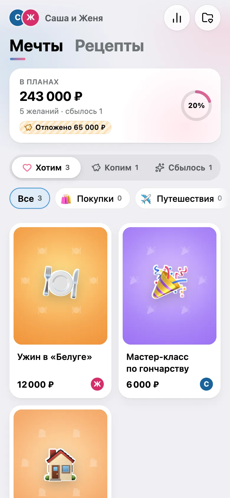
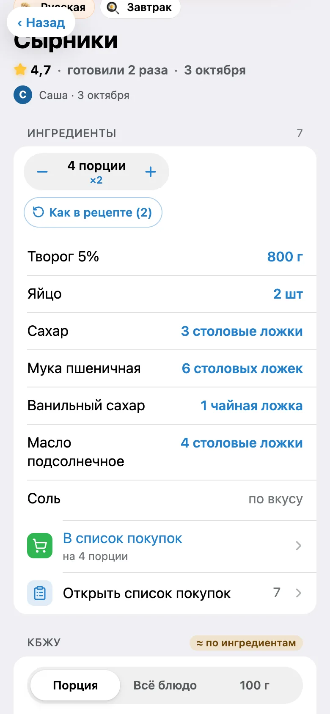
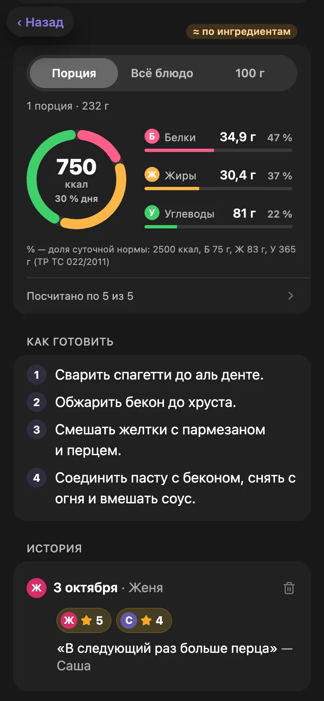
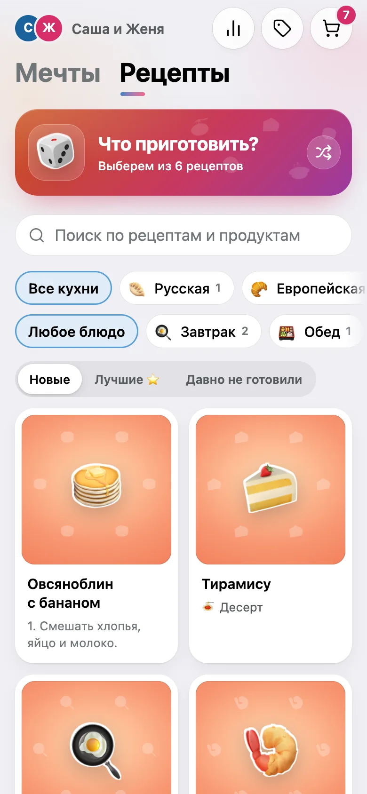
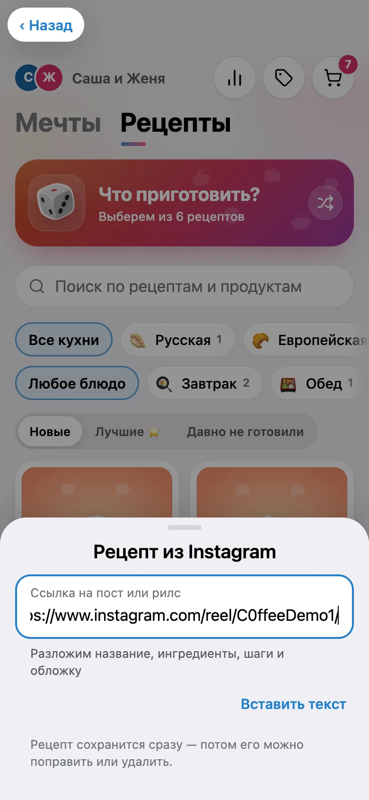
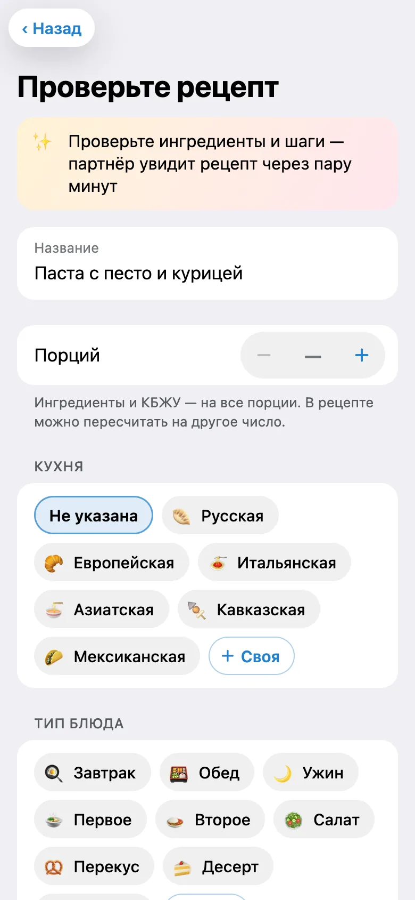
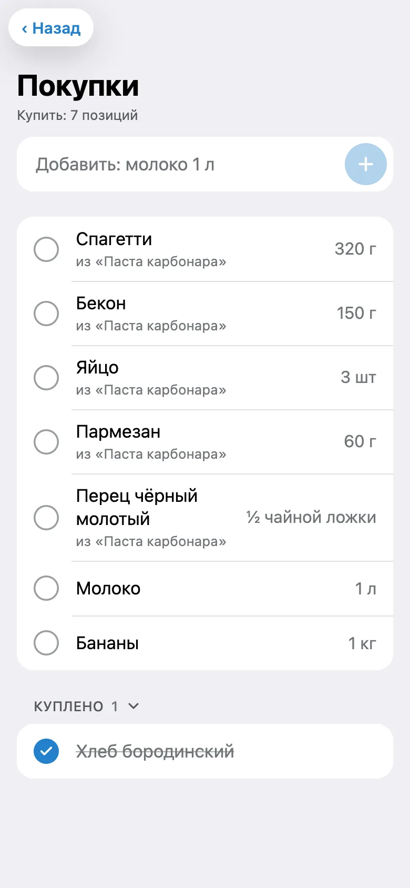
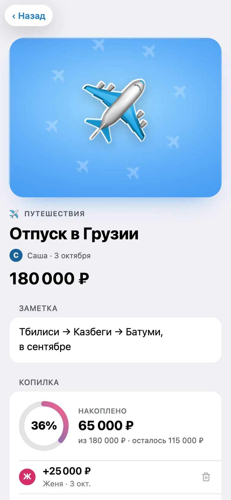
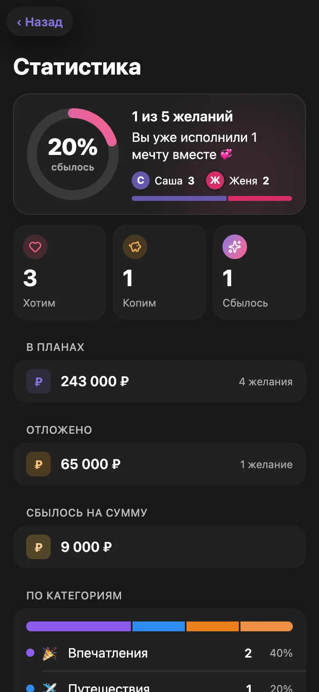

# dreamer-bot

**A private Telegram bot and Mini App for two people:** a shared wish list with savings, recipes with Instagram import and calorie/macro (КБЖУ) estimates, and a shared shopping list. Only the Telegram accounts you whitelist can use it — everyone else gets no reply at all.

[](https://github.com/Mikkkin/dreamer-bot/actions/workflows/ci.yml)
[](LICENSE)

🇷🇺 [Русская версия](README.ru.md) — the app itself speaks Russian.

<p align="center">
  
  
  
</p>

## Features

- 🎁 **Wishes** — *want → saving up → came true*, photos and links, a piggy bank that shows how much of the price is saved.
- 📥 **Recipes from an Instagram link** — send the bot a reel: title, ingredients, steps and photo are filled in. With a Gemini key, even when the recipe is only in the video.
- 🍽 **Servings and macros** — «− 4 порции +» rescales the whole recipe; calories and macros are estimated from the ingredients and drawn as a chart.
- 🥄 **Units that read right** — «½ чайной ложки», «2 столовые ложки»; type `1/2`, `1 1/2`, `0,5` or «полторы».
- 🛒 **Shared shopping list** — a recipe's ingredients in one tap; the same product adds up: 200 мл + 0,5 л = 700 мл.
- ⭐ **Cooking history** — «Приготовили», both partners' ratings, and «Что приготовить?» for a random pick.
- 🔔 **Partner notifications** about new wishes, recipes, savings and dreams that came true.

## Install in 3 commands

**You need**
- a fresh Ubuntu or Debian server (amd64 or arm64, 1 GB RAM or more — the script adds swap on small ones) with root login;
- `git` and `ssh` on your computer (built into macOS and Linux; on Windows use Git Bash or WSL);
- a bot token: [@BotFather](https://t.me/BotFather) → `/newbot`;
- a domain for the Mini App — a free one works: a [FreeDNS](https://freedns.afraid.org) or [DuckDNS](https://www.duckdns.org) subdomain. **Create the A record pointing at the server first** — the script checks DNS and waits until it resolves. Without a domain only the chat bot works.

**0. If you log in to the server with a password**, put your SSH key there first — password login is turned off by the install:

```bash
ls ~/.ssh/id_ed25519.pub || ssh-keygen -t ed25519   # create a key if you have none
ssh-copy-id root@SERVER_IP
```

**1–3. Install** — on your computer:

```bash
git clone https://github.com/Mikkkin/dreamer-bot.git && cd dreamer-bot
scp deploy/setup-vds.sh root@SERVER_IP:
ssh -t root@SERVER_IP 'bash setup-vds.sh'
```

[`deploy/setup-vds.sh`](deploy/setup-vds.sh) asks its questions and does the rest: updates the system, creates your user, turns off password and root login, sets up the firewall and fail2ban, installs Docker, builds the bot on the server, gets an HTTPS certificate and starts everything — usually within a few minutes. The script speaks Russian; its questions, in order:

| # | It asks | What to answer |
|:-:|---|---|
| 1 | Обновить пакеты системы? (upgrade packages) | Enter — yes |
| 2 | Имя пользователя для SSH (SSH user) | Enter for `deploy`, or your own |
| 3 | A password for sudo | make one up: it is for `sudo` only, SSH won't accept it |
| 4 | Публичный ключ (public key) — *only if root has no keys* | `cat ~/.ssh/id_ed25519.pub` on your computer |
| 5 | **Вход под deploy по ключу работает? (does key login work?)** | ⚠️ Keep this window open and run `ssh deploy@SERVER_IP` in a **new** terminal. If it logs you in, answer `y`. Enter (= no) rolls the SSH changes back and stops the script |
| 6 | `BOT_TOKEN` | from @BotFather, input hidden |
| 7 | `ALLOWED_USER_IDS` | Enter if you don't know them — the bot tells you |
| 8 | How to open the Mini App: 1, 2 or 3 | `1` your domain or FreeDNS, `2` DuckDNS (asks for the subdomain and token), `3` no domain |
| 9 | E-mail для Let's Encrypt | any e-mail of yours |
| 10 | Currency and time zone | Enter for `EUR` and `Europe/Amsterdam`, or e.g. `USD` and `America/New_York` |
| 11 | A Gemini key — optional | [aistudio.google.com/apikey](https://aistudio.google.com/apikey), free; Enter skips it |

<sub>Installing from your own private fork: `REPO_URL=https://github.com/you/fork.git REPO_SSH=git@github.com:you/fork.git REPO_SETTINGS_KEYS=https://github.com/you/fork/settings/keys bash setup-vds.sh` — the script shows a deploy key for *Settings → Deploy keys* (no write access).</sub>

## After the install

Root login is closed now — log in as your user:

1. Send `/start` to the bot — it replies with your Telegram ID. Your partner does the same.
2. On the server:
   ```bash
   ssh deploy@SERVER_IP
   sudo dreamer-vds ids        # asks for the sudo password; paste both IDs separated by a comma
   ```
3. `/start` again — the **✨ Мечты** button opens the app.

## Updating

```bash
ssh deploy@SERVER_IP
sudo dreamer-vds update
```

It pulls the new version, builds it while the old one keeps running, archives the data to `/var/backups/dreamer/`, and restarts the bot. The data (database and photos) lives in a Docker volume: updates never delete it, and the archive is taken before the new version's first start, which may migrate the database.

Other commands: `sudo dreamer-vds status | ids | env | backup | restore`. `env` asks every settings question again; to change one line, `nano /opt/dreamer-bot/.env` and then `cd /opt/dreamer-bot && docker compose up -d` is quicker.

## Using it

Most things happen in the Mini App: the **✨ Мечты** button in the bot chat. You can also just send the bot:

- **an Instagram post or reel link** — it becomes a recipe;
- **text, a link or photos** — it becomes a draft wish or recipe with buttons.

| Command | What it does |
|---|---|
| `/list` | Wishes by status |
| `/recipes` · `/cook` | All recipes · a random one for today |
| `/shop` | The shopping list: tick off what you bought |
| `/stats` | Totals per category and currency |
| `/start` · `/help` · `/cancel` | The app button · help · cancel the current input |

## Screenshots

| | | |
|:---:|:---:|:---:|
|  |  |  |
| Recipes by cuisine and course | Import from Instagram | Review after import |
|  |  |  |
| Shopping list | Piggy bank | Statistics |

## Details

<details>
<summary><b>Recipe import and the Gemini key</b></summary>

Import works without any key. The server reads the post the way a link preview does — the caption and the cover — and rules pick out the title, the ingredients with amounts, the steps and the servings, usually in a couple of seconds.

A model key helps in two cases:
- **captions without a clear structure** (prose, another language) are parsed by the model;
- **recipes that exist only in the video** (spoken or shown on screen) are read by Gemini from the reel. That takes up to 90 seconds, and the video is deleted from Google's storage afterwards.

The setup script asks for the key. To add or change it later, edit the line `LLM_API_KEY=…` in `/opt/dreamer-bot/.env`, then run `cd /opt/dreamer-bot && docker compose up -d`. The default model is `gemini-3.8-flash`. To check: the output of `docker compose logs bot | grep llm` should contain `(captions and videos)`.

Gemini's free tier is enough for a couple. On it Google may use what you send (captions and videos of public posts) to improve its products; on a paid plan it doesn't, and a reel costs about a cent. Limits: 20 videos a day per person (the count resets at midnight in `TZ` and when the bot restarts), two at a time, and a burst of 5 imports, then one every 20 seconds. Sending the same post again returns the recipe you already have.

</details>

<details>
<summary><b>Backups and rollback</b></summary>

```bash
sudo dreamer-vds backup                                  # an archive right now
sudo dreamer-vds restore                                 # list the archives
sudo dreamer-vds restore /var/backups/dreamer/<file>     # restore one (the current data is archived first)
```

`update` archives the data before starting a new version, keeps the last 10 archives, and prints the rollback commands. Restore checks the archive, unpacks it next to the data and puts the previous data back if the bot does not start on the restored one. Never run `docker compose down -v`: `-v` deletes the data volume.

</details>

<details>
<summary><b>Manual install with Docker Compose</b></summary>

You need Docker with Compose v2 and open ports 80 and 443.

```bash
git clone https://github.com/Mikkkin/dreamer-bot.git && cd dreamer-bot
cp .env.example .env && chmod 600 .env
```

Fill in `.env`:

```dotenv
BOT_TOKEN=123456789:AA...            # from @BotFather
DOMAIN=dreams.mooo.com               # your (free) domain
WEBAPP_URL=https://dreams.mooo.com/
ACME_EMAIL=you@example.com           # for the certificate authority
COMPOSE_PROFILES=caddy
LLM_API_KEY=                         # optional: a Gemini key
```

```bash
docker compose up -d --build
```

Caddy gets the certificate by itself (Let's Encrypt, or ZeroSSL if Let's Encrypt's limits are used up). Then `/start` the bot, put both IDs into `ALLOWED_USER_IDS` and run `docker compose up -d`. After editing `.env`, use `up -d`: `restart` does not pick up new values.

</details>

<details>
<summary><b>Other setups: DuckDNS, Cloudflare Tunnel, no domain</b></summary>

The chat bot needs no domain: it connects out to Telegram (long polling) and accepts no incoming connections. Telegram opens the Mini App only from a public `https://` address with a valid certificate. The image is built on your server; CI checks that it builds for **linux/amd64 and linux/arm64**.

| Profiles | When | What you need | `.env` |
|---|---|---|---|
| `caddy` | Server with a static public IP | a domain with an A/AAAA record; ports 80 and 443 | `DOMAIN`, `WEBAPP_URL`, `ACME_EMAIL` |
| `caddy,duckdns` | Home server with a changing IP | a DuckDNS subdomain; 80 and 443 forwarded; a real public IP | + `DUCKDNS_SUBDOMAIN`, `DUCKDNS_TOKEN` |
| `tunnel` | No open ports at all | a domain on Cloudflare | `CLOUDFLARE_TUNNEL_TOKEN`, `WEBAPP_URL` |
| `quick` | A try-out without a domain | a network that allows Cloudflare tunnels | leave `WEBAPP_URL` empty |
| *(none)* | Behind your own reverse proxy | HTTPS proxied to `127.0.0.1:8080` | `WEBAPP_URL` |

- **DuckDNS:** create a subdomain on duckdns.org and set `DOMAIN=name.duckdns.org`, `WEBAPP_URL=https://name.duckdns.org/`, `DUCKDNS_SUBDOMAIN`, `DUCKDNS_TOKEN` and `COMPOSE_PROFILES=caddy,duckdns`. The IP is updated every 5 minutes.
- **Cloudflare Tunnel:** Zero Trust → *Networks → Tunnels* → a tunnel with the Docker connector and a public hostname → `HTTP` → `bot:8080`; set `CLOUDFLARE_TUNNEL_TOKEN`, `WEBAPP_URL` and `COMPOSE_PROFILES=tunnel`.
- **Quick tunnel:** a temporary `https://*.trycloudflare.com` address that changes on every restart — for trying things out only.

</details>

<details>
<summary><b>All <code>.env</code> settings</b></summary>

Each variable is documented in [`.env.example`](.env.example).

| Variable | Default | Meaning |
|---|---|---|
| `BOT_TOKEN` | — (required) | Token from @BotFather |
| `ALLOWED_USER_IDS` | empty = setup mode | Comma-separated Telegram IDs |
| `WEBAPP_URL` | empty | Public HTTPS address of the Mini App |
| `DEFAULT_CURRENCY` | `EUR` | `EUR`, `USD`, `RUB` or `GBP` |
| `TZ` | `Europe/Amsterdam` (`UTC` if the line is missing) | Time zone, e.g. `Europe/Moscow` |
| `LLM_API_KEY` | empty = off | Model key for recipe import; treat it like the bot token |
| `LLM_PROVIDER` | `gemini` | `gemini` (captions and videos), `anthropic` or `openai` (any OpenAI-compatible API) |
| `LLM_MODEL` | `gemini-3.8-flash` | `claude-haiku-4-5` for `anthropic`; required for `openai` |
| `LLM_BASE_URL` | — | `openai` only, `https://api.openai.com/v1` by default |
| `INITDATA_MAX_AGE` | `24h` | How long one Mini App launch stays valid (`1m`–`168h`) |
| `MAX_IMAGE_MB` | `10` | Upload limit for one photo (1–50) |
| `LOG_LEVEL` | `info` | `debug`, `info`, `warn`, `error` |
| `HTTP_PORT` | `8080` | Host port on `127.0.0.1` |
| `HTTP_ADDR`, `DATA_DIR` | `:8080`, `./data` (`/data` in the container) | Only when running without Docker |
| `COMPOSE_PROFILES` | — | e.g. `caddy` or `caddy,duckdns` |
| `DOMAIN`, `ACME_EMAIL` | — | `caddy` profile |
| `DUCKDNS_SUBDOMAIN`, `DUCKDNS_TOKEN` | — | `duckdns` profile |
| `CLOUDFLARE_TUNNEL_TOKEN` | — | `tunnel` profile |
| `QUICK_TUNNEL_METRICS_URL` | `http://quicktunnel:20241` | Where the `quick` profile reads its address; empty turns the lookup off |

</details>

<details>
<summary><b>Security</b></summary>

- **Whitelist.** Messages from strangers are dropped without a reply; only the sender's ID is logged. The bot leaves any group or channel it is added to.
- **Mini App login** uses Telegram's signed launch data: HMAC-SHA256 checked in constant time, an age limit, rejection of duplicated parameters, and the whitelist. No cookies, no sessions.
- **Secrets.** The bot token is the only root secret (plus the optional model key). The login and image-link keys are derived from it. Neither ever reaches the logs.
- **Images** are checked by content (JPEG, PNG, WebP), re-encoded without EXIF or GPS, and served only through signed, expiring links.
- **Outbound calls** go only to Telegram, Instagram and its CDN (the post address is rebuilt from the link; redirects to other hosts are refused) and, with a key, to the model provider. The key travels in a header only. A post's caption is untrusted data for the model, and its answer is validated like user input.
- **Web and container.** A strict CSP, rate limits, long polling instead of a webhook; a distroless image without a shell, a non-root user, a read-only filesystem, all capabilities dropped.
- **Server** after `setup-vds.sh`: key-only SSH without root, UFW (SSH, 80, 443), fail2ban, automatic security updates.

Found a vulnerability? Please report it through a [private security advisory](https://github.com/Mikkkin/dreamer-bot/security/advisories/new), not a public issue.

</details>

<details>
<summary><b>How it is built, and development</b></summary>

```
Telegram ──long polling──▶ bot (go-telegram/bot) ─┐
                                                  ├─▶ services ─▶ SQLite (WAL) + image store
Mini App ──HTTPS /api───▶ HTTP API (net/http) ────┘
   ▲ React 19 + Vite, embedded into the Go binary
```

- **Backend:** Go 1.27, go-telegram/bot, `modernc.org/sqlite` (pure Go, a static binary). `internal/domain` holds the rules, `internal/service` the use cases, `internal/recipeimport` the Instagram import, `internal/nutrition` the macro estimates from a food table (USDA data and typical label values). The HTTP contract is in [`docs/API.md`](docs/API.md).
- **Frontend:** React 19, Vite, TypeScript, bun; custom components on Telegram theme variables.

You need Go ≥ 1.27 and bun. The Makefile runs what CI runs:

```bash
make web           # bun install and build the Mini App (needed before check)
make check         # gofmt, vet, staticcheck, go test -race, govulncheck, frontend typecheck and tests
make build run     # embed the Mini App, run the binary with ./data and your .env
make test-setup    # shellcheck and container tests for the setup script (needs Docker)
```

</details>

<details>
<summary><b>Troubleshooting</b></summary>

Run the `docker compose` commands from the bot's folder on the server: `cd /opt/dreamer-bot`.

- **The bot doesn't answer.** Check your ID in `ALLOWED_USER_IDS`: `docker compose logs bot | grep dropped`.
- **`409 Conflict` in the logs.** Two copies of the bot use the same token — stop the other one.
- **"check BOT_TOKEN".** Telegram rejected the token — get a new one with `/revoke` in @BotFather.
- **The menu button doesn't open the app.** `WEBAPP_URL` must be an `https://` address that opens on your phone.
- **No certificate.** The domain must point at the server (`dig +short your.domain`) and ports 80 and 443 must be open. Details: `docker compose logs caddy`.
- **Instagram didn't give the post.** It happens now and then — paste the caption text (the Mini App switches to the text field by itself) or try later.
- **Video recipes aren't read.** `docker compose logs bot | grep llm` must contain `(captions and videos)`; `"llm":"off"` means there is no key in `.env`. The daily video limit resets at midnight in `TZ` and when the bot restarts.

Still stuck? [Open an issue](https://github.com/Mikkkin/dreamer-bot/issues) with the output of `sudo dreamer-vds status` (it contains no tokens or keys).

</details>

## License

[GNU AGPL-3.0](LICENSE) © 2026 Dmitry Khangildin. You may use, copy and change it, but derived versions stay under the AGPL-3.0 and keep the attribution. If you run a modified version for other people (as a bot or Mini App), offer them its source code. Third-party data and libraries keep their own terms — see [NOTICE](NOTICE).
