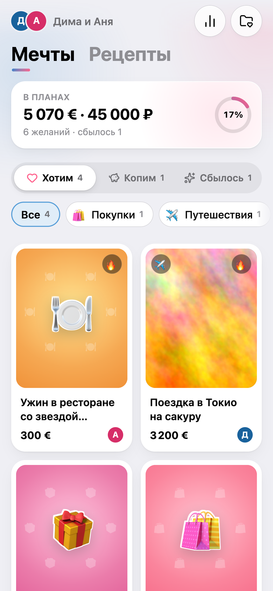
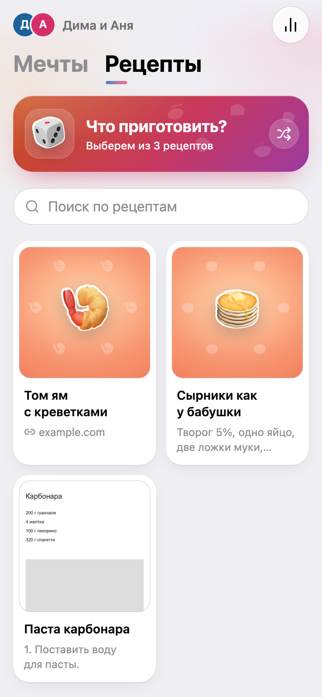
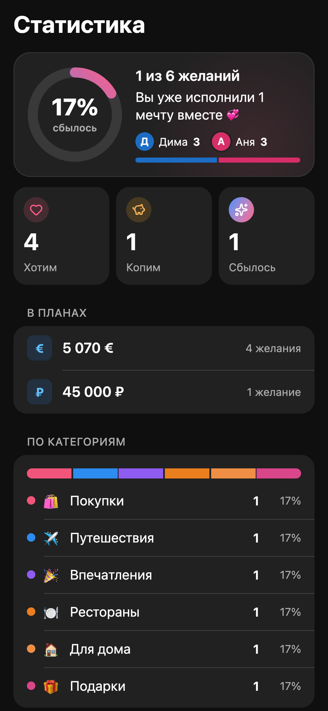

# dreamer-bot

Личный Telegram-бот с Mini App для двоих. В нём вы вместе ведёте список желаний (что купить, куда поехать, что попробовать) и рецептов, которые хотите приготовить. Доступ есть только у Telegram-аккаунтов из белого списка. Всем остальным бот просто не отвечает.

[](https://github.com/Mikkkin/dreamer-bot/actions/workflows/ci.yml)

🇬🇧 [English version](README.md)

<p align="center">
  
  
  
</p>

## Что умеет

- **Желания.** Категории, фото и статусы «Хотим → Копим → Сбылось ✨». Сумма и ссылка **необязательны**: в форме они прячутся за переключателями и появляются, только если их включить.
- **Рецепты («Что приготовить»).** Простой список без категорий и статусов. Можно дать ссылку на рецепт, написать его самому, приложить скриншоты или всё сразу. Если не можете решить, кнопка «🎲 Что приготовить?» выберет случайный.
- **Mini App.** Основной интерфейс. Подстраивается под светлую или тёмную тему Telegram у каждого из вас, использует нативные кнопки Telegram и вибрацию.
- **Чат-бот.** Пришлите текст, ссылку или фото, и бот соберёт черновик-карточку. Кнопками выбираете, желание это или рецепт, категорию, сумму, ссылку, затем сохраняете. `/list`, `/recipes`, `/cook` и `/stats` работают прямо в чате.
- **Уведомления партнёру.** Когда один из вас добавляет желание или рецепт либо отмечает, что мечта сбылась, второму приходит сообщение с фото и кнопкой «Открыть ✨».
- **Статистика.** Итоги по категориям и валютам (валюты не смешиваются и не конвертируются), а ещё сколько мечт сбылось в этом году.

## Настройка VDS одной командой

[`deploy/setup-vds.sh`](deploy/setup-vds.sh) превращает чистый сервер с Ubuntu 22.04/24.04 или Debian 12/13 (amd64 или arm64) в готовый деплой. Скрипт спрашивает только нужное и делает следующее:
- обновляет систему и добавляет swap на маленьких серверах;
- создаёт администратора с вашим SSH-ключом и переводит SSH на вход только по ключу, без входа под root (перед этим проверяет, что ваш ключ работает);
- настраивает UFW (открыты только SSH, 80 и 443), fail2ban и автообновления безопасности;
- ставит Docker;
- клонирует репозиторий (для приватного — через deploy key только на чтение);
- заполняет `.env`, проверяет, что DNS указывает на сервер, запускает бота и ждёт, пока заработает сертификат **Let's Encrypt**. Продлевает его Caddy сам.

```bash
scp deploy/setup-vds.sh root@<ip-сервера>:
ssh -t root@<ip-сервера> 'bash setup-vds.sh'   # -t нужен для вопросов скрипта
```

Потом скрипт устанавливает себя как `dreamer-vds`: `sudo dreamer-vds update | ids | env | status`.

## Быстрый старт (VPS + бесплатный домен)

Понадобятся:
- сервер с «белым» IP и открытыми портами 80 и 443, например любой небольшой VPS на amd64 или arm64;
- Docker с Compose v2;
- токен бота от [@BotFather](https://t.me/BotFather) (команда `/newbot`).

Домен можно взять бесплатно:
- [FreeDNS](https://freedns.afraid.org): создайте поддомен вроде `dreams.mooo.com` с **A-записью** на IP сервера.
- [DuckDNS](https://www.duckdns.org): инструкция в разделе [Варианты запуска](#варианты-запуска).

```bash
git clone https://github.com/Mikkkin/dreamer-bot.git && cd dreamer-bot
cp .env.example .env && chmod 600 .env
```

Заполните `.env`:

```dotenv
BOT_TOKEN=123456789:AA...            # от @BotFather
DOMAIN=dreams.mooo.com               # ваш (бесплатный) домен
WEBAPP_URL=https://dreams.mooo.com/
ACME_EMAIL=you@example.com           # e-mail для центра сертификации
COMPOSE_PROFILES=caddy
```

```bash
docker compose up -d --build
```

HTTPS-сертификат Caddy получит сам. Сначала он пробует Let's Encrypt, а если у общего бесплатного домена исчерпаны его лимиты, переключается на ZeroSSL. Дальше:

1. Напишите боту `/start`. Пока `ALLOWED_USER_IDS` пуст, бот работает в **режиме настройки** и присылает ваш Telegram ID. Попросите партнёра сделать то же самое.
2. Впишите оба ID в `.env`, например `ALLOWED_USER_IDS=111111111,222222222`, и выполните `docker compose up -d`.
3. Снова напишите `/start`: кнопка меню **✨ Мечты** теперь открывает Mini App.

## Варианты запуска

> **Нужен ли домен вообще?** Чат-боту не нужен. Он сам подключается к Telegram (long polling), входящие соединения ему не требуются, поэтому бот работает где угодно, даже на ноутбуке за NAT. Хватит `docker compose up -d` без профилей. С **Mini App** иначе: Telegram открывает её только по публичному адресу `https://` с настоящим сертификатом, так что для приложения нужен один из вариантов ниже.

Во всех вариантах используется один образ, собранный под **linux/amd64 и linux/arm64**: подойдут x86-VPS, Raspberry Pi и Mac на Apple Silicon. Профили задаются через `COMPOSE_PROFILES` в `.env` или флагом `--profile` в каждой команде.

| Профили | Когда | Что нужно | В `.env` |
|---|---|---|---|
| `caddy` | Сервер со статическим «белым» IP | любой домен (свой или бесплатный на FreeDNS) с A/AAAA-записью на сервер; открытые порты 80 и 443 | `DOMAIN`, `WEBAPP_URL`, `ACME_EMAIL` |
| `caddy,duckdns` | Домашний сервер с меняющимся IP | бесплатный поддомен DuckDNS; порты 80 и 443, проброшенные на роутере; «белый» IP (не NAT провайдера) | то же + `DUCKDNS_SUBDOMAIN`, `DUCKDNS_TOKEN` |
| `tunnel` | Открыть порты невозможно | домен в Cloudflare | `CLOUDFLARE_TUNNEL_TOKEN`, `WEBAPP_URL` |
| `quick` | Быстро попробовать без домена | сеть, где не заблокированы туннели Cloudflare (исходящий порт 7844) | `WEBAPP_URL` пустой |
| *(без профиля)* | Свой reverse proxy | прокси с HTTPS, который перенаправляет на `127.0.0.1:8080` | `WEBAPP_URL` |

**DuckDNS (`caddy,duckdns`)**
1. Войдите на duckdns.org, создайте поддомен (например, `ourdreams`) и скопируйте токен.
2. Укажите `DOMAIN=ourdreams.duckdns.org`, `WEBAPP_URL=https://ourdreams.duckdns.org/`, `DUCKDNS_SUBDOMAIN=ourdreams` и `DUCKDNS_TOKEN=<токен>`.
3. Выполните `docker compose up -d --build` с `COMPOSE_PROFILES=caddy,duckdns`.

Сервис `duckdns` обновляет IP раз в 5 минут. Токен уходит только на duckdns.org по HTTPS и в логи не попадает.

**Cloudflare named tunnel (`tunnel`)**
1. В Cloudflare Zero Trust откройте *Networks → Tunnels* и создайте туннель. Коннектор выберите Docker и скопируйте токен.
2. Добавьте публичный хостнейм, например `dreams.example.com`, с сервисом `HTTP` → `bot:8080`.
3. Укажите `CLOUDFLARE_TUNNEL_TOKEN=<токен>`, `WEBAPP_URL=https://dreams.example.com/` и `COMPOSE_PROFILES=tunnel`.

**Quick tunnel (`quick`)** даёт временный адрес `https://*.trycloudflare.com`. `WEBAPP_URL` оставьте пустым: бот сам узнает адрес и поставит кнопку меню. При каждом перезапуске адрес меняется, так что этот вариант годится только чтобы попробовать. В некоторых сетях туннели Cloudflare блокируются. Если в логах есть `failed to dial to edge` или `TLS handshake with edge error`, используйте домен.

Если образ собирается на одной машине, а запускается на другой, соберите его под обе платформы: `make image-multiarch`. Чтобы отправить образ в registry: `make image-multiarch IMAGE=ghcr.io/you/dreamer-bot PUSH=1`.

## Настройки

Все настройки задаются переменными окружения. Docker Compose берёт их из `.env`, а в [`.env.example`](.env.example) каждая описана.

| Переменная | По умолчанию | Назначение |
|---|---|---|
| `BOT_TOKEN` | — (обязательно) | Токен от @BotFather |
| `ALLOWED_USER_IDS` | пусто = режим настройки | Telegram ID тех, кому можно пользоваться ботом, через запятую |
| `WEBAPP_URL` | пусто | Публичный HTTPS-адрес Mini App. С профилем `quick` оставьте пустым |
| `DEFAULT_CURRENCY` | `EUR` | `EUR`, `USD`, `RUB` или `GBP` |
| `INITDATA_MAX_AGE` | `24h` | Сколько действует один запуск Mini App (от `1m` до `168h`) |
| `MAX_IMAGE_MB` | `10` | Максимальный размер одного фото (1–50) |
| `TZ` | `UTC` | Часовой пояс для дат и статистики «в этом году», например `Europe/Amsterdam` |
| `LOG_LEVEL` | `info` | `debug`, `info`, `warn` или `error` |
| `HTTP_PORT` | `8080` | Порт на `127.0.0.1`, по которому Mini App тоже доступна |
| `COMPOSE_PROFILES` | — | Какие профили запускать, например `caddy` или `caddy,duckdns` |
| `DOMAIN`, `ACME_EMAIL` | — | Профиль `caddy`: домен и e-mail для центра сертификации (оба обязательны) |
| `DUCKDNS_SUBDOMAIN`, `DUCKDNS_TOKEN` | — | Только для профиля `duckdns` |
| `CLOUDFLARE_TUNNEL_TOKEN` | — | Только для профиля `tunnel` |

## Команды бота

| Команда | Что делает |
|---|---|
| `/start` | Приветствие и кнопка, которая открывает приложение |
| `/list` | Желания по статусам, постранично. Нажмите на желание, чтобы открыть карточку |
| `/recipes` | Все рецепты |
| `/cook` | Случайный рецепт на сегодня |
| `/stats` | Итоги по категориям и валютам |
| `/help` | Как пользоваться ботом |
| `/cancel` | Отменить текущий ввод или черновик |

Можно обойтись и без команд: просто пришлите боту текст, ссылку, фото или альбом, и он превратит это в черновик-карточку с кнопками.

## Как устроена безопасность

- **Один корневой секрет.** Токен бота — единственный секрет. От него выводятся ключи для проверки входа в Mini App и для подписи ссылок на картинки, у каждого своё назначение. Токен не попадает в логи: все записи проходят через фильтр, который его вырезает. Ошибки HTTP-клиента, в URL которых есть токен, тоже очищаются.
- **Сначала белый список.** Сообщения от пользователей вне списка отбрасываются без ответа и без подтверждения. В лог попадает только ID отправителя. Сообщения из групп и каналов игнорируются, а если бота добавят в группу, он из неё выйдет.
- **Вход в Mini App.** Каждый запрос к API несёт подписанные Telegram данные запуска (`Authorization: tma …`). Сервер проверяет:
  - подпись HMAC-SHA256, сравнением за постоянное время;
  - срок её действия;
  - что ни один параметр не повторяется (защита от известного приёма с подменой параметров);
  - что ID пользователя есть в белом списке.

  Ни кук, ни серверных сессий нет.
- **Картинки.** Размер загрузок ограничен. Формат определяется по содержимому файла (только JPEG, PNG или WebP), а слишком большие по пикселям изображения отклоняются ещё до декодирования. Каждое фото перекодируется, поэтому из него пропадают EXIF и GPS. Файлы хранятся под случайными именами, которые генерирует сервер. Отдаются они только по подписанным HMAC ссылкам с ограниченным сроком действия.
- **Сервер ничего не скачивает по ссылкам.** Ссылки только проверяются (разрешены http и https) и показываются, но сервер по ним не ходит, поэтому для SSRF просто нет точки входа.
- **Защита веб-части.**
  - Строгая Content-Security-Policy: из внешних скриптов разрешён только `telegram-web-app.js` от Telegram, встраивать приложение во фрейм может только `web.telegram.org`.
  - Заголовки `nosniff` и `no-referrer`.
  - Лимиты запросов на каждого пользователя, ограничения размера тела запроса и таймауты сервера.
  - Бот получает обновления через long polling, так что публичного вебхука, который можно атаковать, нет.
- **Контейнер.** Distroless-образ без shell. Процесс работает от непривилегированного пользователя (UID 65532) на корневой ФС только для чтения, все capabilities Linux сброшены, включён `no-new-privileges`. Токен Cloudflare в контейнер бота не передаётся.

Нашли уязвимость? Сообщите о ней через приватный security advisory на GitHub, а не в открытом issue.

## Резервная копия

Все данные лежат в Docker-томе `dreamer-data`: база SQLite и обработанные картинки.

```bash
docker compose stop bot
docker run --rm -v dreamer_dreamer-data:/data -v "$PWD":/backup alpine \
  tar czf /backup/dreamer-backup.tgz -C /data .
docker compose start bot
```

Чтобы восстановить данные, остановите бота и распакуйте архив обратно в том: вместо `tar czf` используйте `tar xzf`. Владельцем `/data` должен остаться UID 65532, поэтому добавьте к `docker run` флаг `--user 65532:65532`.

## Как устроено

```
Telegram ──long polling──▶ бот (go-telegram/bot) ─┐
                                                  ├─▶ сервисы ─▶ SQLite (modernc, WAL) + хранилище картинок
Mini App ──HTTPS /api───▶ HTTP API (net/http) ────┘
   ▲ React 19 + Vite, вшит в бинарник Go
```

- **Бэкенд:** Go 1.27, [go-telegram/bot](https://github.com/go-telegram/bot) (Bot API 10.3), `modernc.org/sqlite` (чистый Go, поэтому бинарник статический и не требует CGO), `disintegration/imaging` для обработки картинок.
- **Фронтенд:** React 19, Vite 8, TypeScript 7, сборка через bun. Компоненты собственные и работают на переменных темы Telegram, UI-кита нет.
- **Структура:** в `internal/domain` лежат правила и валидация, в `internal/service` сценарии, в `internal/storage/sqlite` и `internal/media` адаптеры. `internal/httpapi` и `internal/bot` — тонкие слои доставки поверх них. Полный контракт HTTP API описан в [`docs/API.md`](docs/API.md).

## Разработка

Понадобятся Go ≥ 1.27 и bun ≥ 1.4. Makefile запускает всё то же, что и CI.

```bash
make check          # gofmt, go vet, staticcheck, go test -race, govulncheck, проверка типов и тесты фронтенда
make web build run  # собрать Mini App, вшить в бинарник и запустить с ./data и вашим .env
```

Чтобы работать над Mini App в обычном браузере:

```bash
cd web && DREAMER_BACKEND_URL=http://127.0.0.1:8080 bun run dev          # Vite на :5173
BOT_TOKEN=... DEV_URL=http://localhost:5173/ bun run dev-url <ваш-telegram-id>
```

`dev-url` печатает подписанную ссылку запуска с отладочной нижней панелью Telegram. Пока не истёк `INITDATA_MAX_AGE`, обращайтесь с этой ссылкой как с паролем.

## Если что-то не работает

- **Бот совсем не отвечает.** Проверьте, есть ли ваш ID в `ALLOWED_USER_IDS`. Каждое отброшенное сообщение попадает в лог вместе с ID отправителя: `docker compose logs bot | grep dropped`.
- **В логах `409 Conflict`.** С этим токеном одновременно работают две копии бота. Остановите лишнюю.
- **Контейнер завершается с «check BOT_TOKEN».** Telegram не принял токен. Получите новый через `/revoke` в @BotFather.
- **Кнопка меню не открывает приложение.** Убедитесь, что `WEBAPP_URL` начинается с `https://` и открывается с телефона. С профилем `quick` текущий адрес видно в строке лога `quick tunnel hostname discovered`.
- **Caddy завершается с «set DOMAIN and ACME_EMAIL».** Заполните обе переменные в `.env`.
- **Нет HTTPS-сертификата.** Домен должен указывать на этот сервер (проверьте: `dig +short ваш.домен`), а порты 80 и 443 должны быть доступны из интернета. Caddy повторяет попытки сам, подробности в `docker compose logs caddy`.
